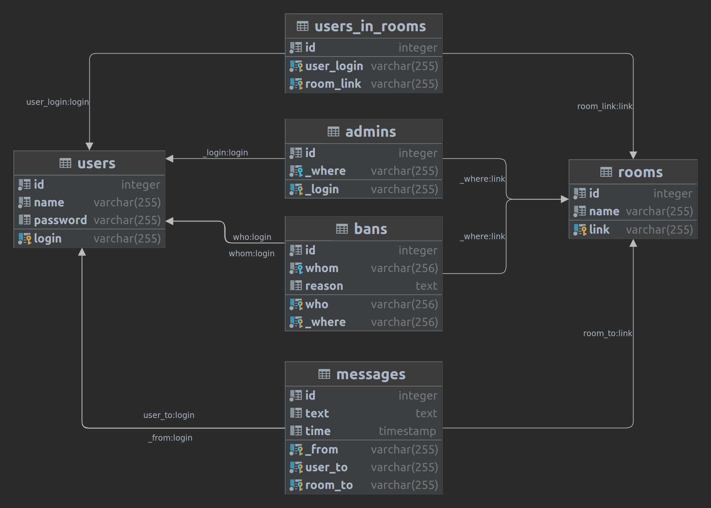

### ChatQL
This is a project for database (PostgreSQL) course. \
It's a simple console chat application based on CPP + PostgreSQL + QSqlDatabase lib.

Connection between server and clients implemented using tcp/ip (AF_INET + SOCK_STREAM sockets) protocol. 
Server can read data from multiple connections using poll() mechanism.

On client side there is a possibility to read/write messages to/from groups or other users.
Also, there is a mechanism to give some users a permission (make them administrators) to block other users.

Here can see the structure of database:

To compile this app QSqlDatabase lib needed.
To run this app running PostgressQL server needed.
